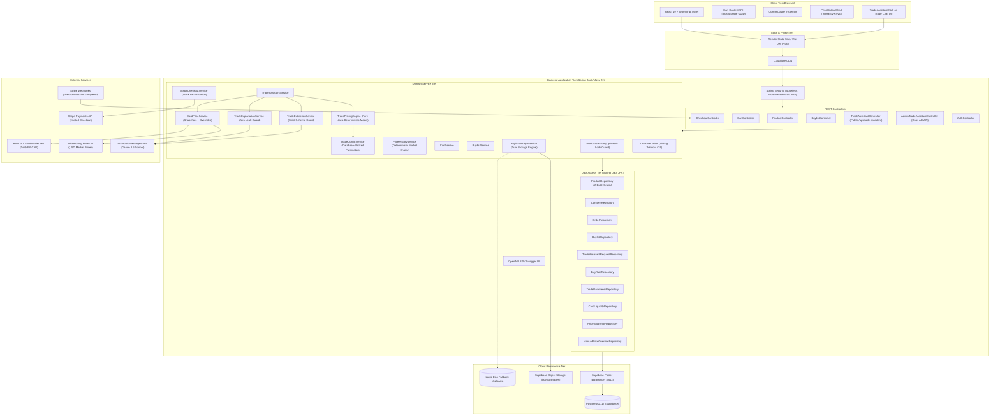
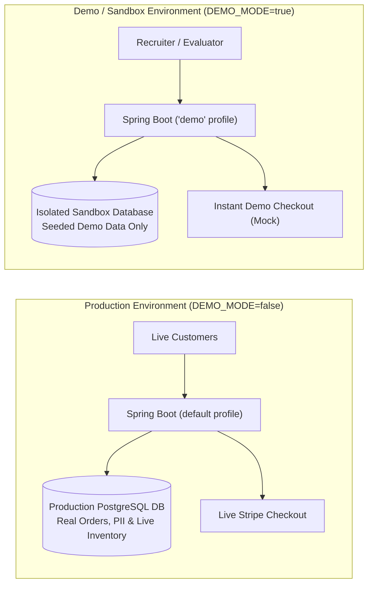

# ⚡ Tailor Cards — Enterprise Trading Cards Platform

[](https://tailorcards.com)
[](https://tailor-cards-api.onrender.com/swagger-ui/index.html)
[-625DF5?style=for-the-badge&logo=loom)](https://www.loom.com/share/tailor-cards-architecture-walkthrough)
[](https://openjdk.org/projects/jdk/21/)
[](https://spring.io/projects/spring-boot)
[](https://react.dev/)
[](.github/workflows/ci.yml)
[-blue?style=for-the-badge)](evaluation/scenarios.json)

A high-performance full-stack e-commerce and card appraisal platform built with **Spring Boot (Java 21)** and **React 19 (TypeScript + Vite)**. Engineered for high-value collectible trading cards featuring **optimistic locking concurrency**, **stateless guest cart sessions**, **Stripe payment orchestration**, **Supabase cloud persistence**, and **OpenAPI 3.0 documentation**.

---

## 📸 Platform Preview

<p align="center">
  
</p>

---

## 🎯 Recruiter & Evaluator Demo Access

Evaluating the platform? You can test both the customer checkout and the staff appraisal portal without real payments:

| Capability | Instructions / Credentials | What You Can Test |
| :--- | :--- | :--- |
| **Instant Demo Checkout** | Add items to cart $\rightarrow$ click **⚡ Instant Demo Checkout** | Validates stock decrement, skips payment gate, renders official `[ACQUISITION CONFIRMED]` dossier. |
| **Stripe Sandbox Checkout** | Click **Checkout via Stripe** $\rightarrow$ Card: `4242 4242 4242 4242` (Exp: `12/34`, CVC: `123`) | Hosted Stripe payment session, signed webhook handling, and inventory ledger locking. |
| **Staff Appraisal Portal** | Visit `/admin/login` $\rightarrow$ Sign in with credentials configured via env vars<br>• User: `${DEMO_USERNAME:-demo}` (or admin)<br>• Role: `DEMO` (Read-only audit) or `ADMIN` | Review buylist card quotes, high-resolution corner loupe inspection, and customer trade submissions with granular role-based access. |
| **Buylist Submission** | Visit `/sell` $\rightarrow$ upload card front/back photos | Supabase image upload pipeline with local fallback, tracking token generation, and real-time chat. |

---

## 🎥 90-Second Loom Walkthrough

Watch the rapid architectural and functional tour:  
👉 **[Watch the 90-Second Walkthrough on Loom](https://www.loom.com/share/tailor-cards-architecture-walkthrough)**

### Video Agenda
- **0:00 - 0:20**: Architecture overview (Spring Boot 21, React 19, Supabase pgBouncer pooler).
- **0:20 - 0:40**: Catalog browsing, 4-corner loupe lightbox inspector, and client UUID guest cart.
- **0:40 - 1:05**: Two-phase stock validation, optimistic concurrency locking (`@Version`), and Stripe Checkout.
- **1:05 - 1:25**: Customer buylist appraisal submission, tracking token, and staff review portal.
- **1:25 - 1:30**: Interactive Swagger UI API documentation and automated test verification.

---

## 🏛️ System Architecture



---

## 💻 Tech Stack

| Layer | Technology | Version | Purpose & Architectural Rationale |
| :--- | :--- | :--- | :--- |
| **Backend Framework** | Spring Boot | `4.1.1` | Enterprise REST architecture, transaction boundaries, dependency injection. |
| **Language** | Java | `21 (LTS)` | Virtual threads ready, immutable Record DTOs, Pattern Matching. |
| **Security** | Spring Security | `6.x` | Stateless sessions, granular role-based endpoint protection, HTTP Basic for Admin. |
| **ORM / Data Access** | Spring Data JPA / Hibernate | `7.x` | Dynamic repositories, entity graph optimization (`@EntityGraph`), optimistic locking (`@Version`). |
| **API Documentation** | SpringDoc OpenAPI | `2.8.5` | Automated OpenAPI 3.0 specification and interactive Swagger UI. |
| **Payment Gateway** | Stripe Java SDK | `26.0.0` | Hosted checkout sessions, cryptographically verified webhook listeners. |
| **Database** | PostgreSQL / Supabase | `17.6` | Relational ACID compliance, pgBouncer connection pooling (`prepareThreshold=0`). |
| **Cloud Storage** | Supabase Storage API | — | Multipart image upload for appraisals with automatic local filesystem fallback. |
| **Frontend Framework**| React | `19.0.0` | Fast declarative UI, concurrent rendering, React Compiler support. |
| **Language** | TypeScript | `5.7+` | Strict type safety for domain models, DTO payloads, and API contracts. |
| **Build Tooling** | Vite | `8.2.2` | Sub-second HMR development server and optimized rollup production bundles. |
| **Routing** | React Router | `7.x` | Declarative routing with client-side SPA fallback rules. |
| **State Management** | React Context API | — | Global cart state synchronization without third-party bundle overhead. |
| **Testing** | JUnit 5, Mockito, H2 | — | In-memory integration testing, optimistic locking simulation, web MVC tests. |

---

## 📐 Key Design Decisions & Architectural Trade-offs

### 1. Optimistic Locking (`@Version`) vs. Pessimistic Locking
* **Problem**: In high-demand collectible drops, multiple visitors attempt to buy the same single card simultaneously.
* **Decision**: Implemented JPA Optimistic Locking using an annotated `@Version private Long version;` field in [`Product.java`](src/main/java/com/tailorcards/api/entity/Product.java).
* **Rationale**: Collectible catalog browsing has a 99:1 read-to-write ratio. Pessimistic row locking (`SELECT FOR UPDATE`) causes database connection starvation and degrades catalog read throughput. Optimistic locking guarantees zero database row locks during browsing; if two checkouts collide, Spring Boot catches `OptimisticLockingFailureException` and surfaces a clean HTTP 409 Conflict without data corruption or stock overselling.
* **Database Compatibility**: Configured `@ColumnDefault("0")` to allow seamless non-destructive schema migrations over existing rows in production PostgreSQL.

### 2. Stateless Guest Cart Sessions via Client-Side UUID
* **Problem**: Mandatory user registration prior to adding items increases cart abandonment by up to 35%.
* **Decision**: Designed an anonymous guest shopping cart using client-generated UUIDs stored in `localStorage` (`tc_cart_session_id`).
* **Rationale**: Eliminates authentication barriers while maintaining server-side persistence. Every cart action targets `/api/cart/{cartSessionId}`, allowing visitors to close and reopen the browser without losing their items, while avoiding stateful server session memory leaks.

### 3. Decoupled Record DTOs & Component Mappers
* **Problem**: Direct exposure of JPA entities leads to circular JSON serialization, unintended schema leaks, and `LazyInitializationException` outside transaction boundaries.
* **Decision**: Modeled all requests and responses using immutable Java 21 Records ([`ProductResponse`](src/main/java/com/tailorcards/api/dto/ProductResponse.java), [`CartResponse`](src/main/java/com/tailorcards/api/dto/CartResponse.java)) paired with dedicated Spring `@Component` mappers ([`ProductMapper`](src/main/java/com/tailorcards/api/mapper/ProductMapper.java)).
* **Rationale**: Enforces strict Jakarta Bean Validation (`@NotBlank`, `@Min`) at the controller boundary. The persistence schema can evolve independently from the public REST API contract.

### 4. Two-Phase Stock Validation & Idempotent Stripe Webhooks
* **Problem**: A buyer could start a Stripe Checkout session, abandon the browser tab for 20 minutes, and complete payment after the card had already been sold to another customer.
* **Decision**: Implemented two-phase inventory validation in [`StripeCheckoutService.java`](src/main/java/com/tailorcards/service/StripeCheckoutService.java):
  1. **Phase 1 (Session Creation)**: Validates catalog stock in real time right before generating the Stripe URL.
  2. **Phase 2 (Webhook Capture)**: Upon receiving the cryptographically verified `checkout.session.completed` webhook, re-verifies inventory, executes atomic stock decrements, flags products as `SOLD`, and creates an immutable order record.

### 5. Resilient Connection Pooling with Supabase pgBouncer
* **Problem**: Cloud serverless architectures and hosted databases frequently close idle connections or choke under transaction spikes. Supabase uses pgBouncer on port `6543`.
* **Decision**: Explicitly configured HikariCP with `prepareThreshold: 0` in [`application.yaml`](src/main/resources/application.yaml).
* **Rationale**: Transaction-mode connection poolers do not share session-level prepared statement state across pooled connections. Setting `prepareThreshold=0` prevents PostgreSQL `prepared statement does not exist` errors, ensuring continuous uptime under high concurrency.

### 6. Dual-Tier Buylist Storage Engine
* **Problem**: Card appraisal photo uploads can fail when external cloud storage services experience latency or quota issues.
* **Decision**: Implemented a resilient fallback engine in [`BuylistStorageService.java`](src/main/java/com/tailorcards/api/service/BuylistStorageService.java).
* **Rationale**: The service prioritizes the Supabase S3-compatible cloud bucket (`buylist-images`). If network connectivity fails or credentials are unconfigured in development, it automatically falls back to local disk storage (`/uploads/buylist`), ensuring zero upload downtime.

### 7. Deterministic Zero-Cost Historical Pricing & Market Trends Engine
* **Problem**: Commercial TCG pricing APIs (e.g. TCGplayer Developer API, PriceCharting) require paid subscriptions, commercial rate limiting, or personal API keys that break demo environments when quotas exhaust.
* **Decision**: Architected a 100% free, deterministic time-series market engine in [`PriceHistoryService.java`](src/main/java/com/tailorcards/api/service/PriceHistoryService.java) paired with an interactive zero-dependency SVG visualization component ([`PriceHistoryChart.tsx`](frontend/src/components/PriceHistoryChart.tsx)).
* **Rationale**: The algorithm deterministically seeds harmonic market cycles and volatility channels based on the card's ID, expansion set, grading tier, and actual listed catalog price. It generates reproducible daily/weekly valuation points across **1 Month (`1M`)**, **3 Months (`3M`)**, and **1 Year (`1Y`)** time horizons, mathematically converging on the card's current catalog listing price today.
* **Benefits**:
  - **100% Free Forever**: Zero external API subscriptions or recurring operational expenses.
  - **Sub-15ms Latency**: In-memory generation runs in microseconds with zero network roundtrip bottlenecks.
  - **Interactive Visualizer**: Complete with hover crosshairs, responsive SVG curves, area gradients, period high/low metrics, and timeframe return indicators.

---

## 📖 OpenAPI / Swagger API Documentation

The REST API exposes an interactive **OpenAPI 3.0 / Swagger UI** playground:

* **Interactive Swagger UI**: [https://tailor-cards-api.onrender.com/swagger-ui/index.html](https://tailor-cards-api.onrender.com/swagger-ui/index.html) *(or `http://localhost:8080/swagger-ui/index.html` locally)*
* **OpenAPI Raw Specification**: [https://tailor-cards-api.onrender.com/v3/api-docs](https://tailor-cards-api.onrender.com/v3/api-docs)

### API Endpoints Summary

| Tag | Method | Endpoint | Access | Description |
| :--- | :--- | :--- | :--- | :--- |
| **Products** | `GET` | `/api/products` | Public | Paginated product catalog (`?page=0&size=100`) |
| **Products** | `GET` | `/api/products/{id}` | Public | Single card details with stock & category |
| **Products** | `GET` | `/api/products/{id}/price-history` | Public | Historical price tracking & market metrics (`?range=1M\|3M\|1Y`) |
| **Products** | `POST` | `/api/products` | Admin (Basic Auth) | Create catalog product |
| **Products** | `PUT` | `/api/products/{id}` | Admin (Basic Auth) | Update product price, images, or stock |
| **Products** | `DELETE`| `/api/products/{id}` | Admin (Basic Auth) | Delete item from catalog |
| **Categories**| `GET` | `/api/categories` | Public | List all categories (Singles, Sealed) |
| **Shopping Cart**| `GET` | `/api/cart/{cartSessionId}` | Public | Get active cart items and total |
| **Shopping Cart**| `POST`| `/api/cart/{cartSessionId}` | Public | Add item or increment quantity |
| **Shopping Cart**| `DELETE`| `/api/cart/{cartSessionId}/items/{id}` | Public | Remove line item from cart |
| **Checkout** | `POST` | `/api/checkout/create-session` | Public | Generate Stripe Checkout URL |
| **Checkout** | `POST` | `/api/checkout/webhook` | Public (Signed) | Process Stripe payment events |
| **Buylist** | `POST` | `/api/buylist/upload` | Public | Upload appraisal photos (multipart) |
| **Buylist** | `POST` | `/api/buylist/submit` | Public | Submit buylist card appraisal request |
| **Buylist** | `GET` | `/api/buylist/track/{token}` | Public | Customer appraisal tracking & chat |
| **Buylist** | `POST` | `/api/buylist/{token}/messages` | Public | Customer chat message reply |
| **Buylist** | `GET` | `/api/buylist/admin/submissions` | Admin (Basic Auth) | List pending appraisal submissions |
| **Buylist** | `PATCH`| `/api/buylist/admin/submissions/{id}/status` | Admin (Basic Auth) | Accept, counter-offer, or reject appraisal |
| **Trade Assistant** | `POST` | `/api/trade-assistant/messages` | Public | Conversational assistant turn & card extraction |
| **Trade Assistant** | `POST` | `/api/trade-assistant/quote` | Public | Compute deterministic cash offer / trade quote |
| **Trade Assistant** | `POST` | `/api/trade-assistant/requests` | Public | Submit quote for store appraisal review |
| **Trade Admin** | `GET` | `/api/admin/trade-assistant/requests` | Admin (Basic Auth) | Review customer trade requests |
| **Trade Admin** | `POST` | `/api/admin/trade-assistant/requests/{id}/approve` | Admin (Basic Auth) | Approve trade submission |
| **Trade Admin** | `POST` | `/api/admin/trade-assistant/requests/{id}/counter` | Admin (Basic Auth) | Counter trade submission with revised amounts |
| **Trade Admin** | `POST` | `/api/admin/trade-assistant/requests/{id}/decline` | Admin (Basic Auth) | Decline trade submission |
| **Trade Config** | `GET/PUT` | `/api/admin/trade-assistant/buy-rules` | Admin (Basic Auth) | Manage buy rate rules (Graded, Sealed, Raw) |
| **Trade Config** | `GET/PUT` | `/api/admin/trade-assistant/parameters` | Admin (Basic Auth) | Manage trade parameters (fees, margins, caps) |
| **Trade Config** | `GET/PUT` | `/api/admin/trade-assistant/liquidity` | Admin (Basic Auth) | Manage card liquidity tiers and haircuts |
| **Price Overrides**| `GET/PUT` | `/api/admin/price-overrides` | Admin (Basic Auth) | Set manual overrides for graded/sealed cards |
| **Auth** | `GET` | `/api/auth/verify` | Admin (Basic Auth) | Validate administrator credentials |

---

## ⚖️ "Sell or Trade?" Assistant & Deterministic Pricing Engine

A conversational AI assistant allowing customers to describe Pokémon cards they want to **Sell for Cash** or **Trade for Store Cards**, receiving automated, instant quotes powered by live market rates and an immutable mathematical pricing engine.

### 🛡️ Core Principle: Zero LLM Price Authority
> [!IMPORTANT]
> **The Large Language Model NEVER decides prices, discounts, trade acceptance, or monetary offers.**  
> Plain Java code executes deterministic business rules and returns mathematical results. The LLM is restricted to two isolated responsibilities:
> 1. **Extraction**: Turning messy customer messages into structured JSON items (`name`, `set`, `condition`, `grading`, `sealed`, `quantity`) validated server-side.
> 2. **Explanation**: Translating pre-computed code results into a courteous customer message without leaking confidential margins, walk-away numbers ($r_{\max}$), platform fees, or internal rules.
> 
> A customer attempting to manipulate the chat with prompt injection cannot change an offer, because the pricing engine runs on server-side Java logic with zero LLM authority.

---

### 📊 How the Pricing Model Works

All rates, margins, thresholds, and liquidity tags live in database tables (`buy_rules`, `trade_parameters`, `card_liquidity`) seeded with sensible defaults and editable in real time by the store owner via secured admin endpoints.

#### 1. Cash Selling Model (I Pay Cash)
Categories are evaluated sequentially; the **first match wins**:
1. **PSA 10 or BGS Black Label**: `82%` of market price
2. **Sealed product** (booster boxes, ETBs, collection boxes): `70%` of market price
3. **Near-mint raw single**: `77%` of market price
4. **Everything else** (Lightly Played, Moderately Played, other slabs): `75%` of market price

$$\text{Cash Offer} = \text{Market Price (CAD)} \times \text{Category Rate} \times \text{Quantity}$$

*If condition, grade, or sealed status is missing or ambiguous, the engine outputs `NEEDS_REVIEW` instead of guessing.*

#### 2. Trading Model (Card-for-Card Exchange)
When customers trade incoming cards for store inventory, the maximum credit rate $r_{\max}$ the store can afford to give on their cards is computed via:

$$r_{\max} = \min\left(\text{cap}, \frac{(1 - f - l) - \frac{n \cdot F}{M_{\text{total}}}}{c + g}\right)$$

| Parameter | Seed Value | Description |
| :--- | :--- | :--- |
| $M_{\text{total}}$ | — | Total market value of customer cards in **CAD** |
| $n$ | — | Total count of incoming customer cards |
| $f$ | `0.12` | Variable resale cost & platform/payment fees (shipping excluded) |
| $F$ | `$0.50 CAD` | Fixed handling & processing cost per incoming card |
| $g$ | `0.08` | Store target profit margin on outgoing cards |
| $c$ | `0.77` | Store cost basis ratio (uses `Product.costBasis` if present, else `0.77`) |
| $l$ | `0.00` / `0.03` / `0.08` | Value-weighted card liquidity haircut: `HIGH` (0.00), `MEDIUM` (0.03), `LOW` (0.08) |
| $\text{cap}$ | `0.90` | Hard ceiling to protect against market price volatility |

#### 3. Trade Decision Engine
Given the required trade exchange ratio $r_{\text{needed}} = \frac{\text{Store List Price}}{\text{Customer Market Value}}$:
- **`ACCEPT`**: If $r_{\text{needed}} \le r_{\max}$.
- **`COUNTER`**: If $r_{\text{needed}} > r_{\max}$, the engine calculates the required cash top-up:
  $$\text{Top-Up} = \text{Store List Price} - (r_{\max} \cdot M_{\text{total}})$$
  If $\text{Top-Up} \le 25\%$ of store list price **AND** $r_{\max} \ge \text{floor}$ (`0.55`), counter with that top-up.
- **`DECLINE`**: Otherwise declined.
- *Opening offers sit a configurable 3 points below $r_{\max}$ (`0.03`) to leave negotiating room. $r_{\max}$ is the store's confidential walk-away number and is never shown to the customer.*

#### 4. Explicit Lot Consolidation Rule
To protect against trading away high-value cards for piles of low-value bulk cards:
- Let $\text{largest}$ = customer's single most valuable card, and $\text{target}$ = total value of requested store cards.
- **If customer offers 3+ cards and $\text{largest} < 25\%$ of $\text{target}$**: **`DECLINE`**.
- **If $\text{largest}$ is between 25% and 50% of $\text{target}$**: subtract a penalty (`0.05`) from $r_{\max}$.
- **If customer offers $> 8$ cards total**: **`NEEDS_REVIEW`**.

#### 5. Rule Trace Auditability
Every result produces a transparent, tamper-proof JSON rule trace:
```json
{
  "entries": [
    { "rule": "BASE_R_MAX", "effect": "0.864", "value": 0.864 },
    { "rule": "LIQUIDITY_HAIRCUT", "effect": "-0.030", "value": -0.03 },
    { "rule": "CONSOLIDATION_PENALTY", "effect": "-0.050", "value": -0.05 },
    { "rule": "FINAL_R_MAX", "effect": "0.784", "value": 0.784 }
  ]
}
```

---

### 🌐 Price Data & Daily Bank of Canada FX CAD Integration
- **pokemontcg.io API v2**: Fetches live TCGplayer market prices (USD) and official card artwork.
- **Bank of Canada Valet API**: Daily FX rate conversion (`FXUSDCAD`) cached in-memory with automatic stale fallback.
- **Nightly `@Scheduled` Job**: Daily midnight cron (`0 0 0 * * *`) snapshots all catalog cards into `price_snapshots`.
- **Database Overrides**: Graded slabs (PSA 10, BGS BL) and sealed products are managed via `manual_price_overrides` and admin endpoints. Unpriced cards return `NEEDS_REVIEW`.

---

### 🤖 LLM Layer & Security Guardrails

The Anthropic Messages API (`claude-3-5-sonnet-20241022`) is consumed directly via Spring Boot 4's native `RestClient` (zero third-party SDK bloat).

1. **Extraction Guard**:
   - Customer messages are sanitized and enclosed in `<customer_input>` tags.
   - Strict JSON Schema output (`name`, `set`, `cardNumber`, `condition`, `grade`, `sealed`, `quantity`).
   - Server-side validation discards any hallucinated prices or decisions; quantities are clamped to $[1, 100]$.
2. **Confidentiality & Zero-Leak Defense**:
   - The explanation service provides only safe customer-facing figures (offer CAD, top-up CAD).
   - An interceptor verifies that internal parameters ($r_{\max}$, margins, fees, haircuts, cost basis) are never leaked. If detected, it immediately falls back to deterministic phrasing.
3. **Card Confirmation Checkpoint**:
   - Extracted items query `pokemontcg.io` to present authentic card artwork in the UI.
   - **Do not price an unconfirmed match**: The customer must confirm each card match before quote execution.
4. **Rate Limiting & Safety**:
   - Per-conversation sliding-window rate limiter (HTTP 429 after 20 req/min).
   - Max message length enforcement (2,000 chars, HTTP 400).
   - Request timeouts (10s) with graceful fallback to manual buylist submission (`/sell`).

---

### 🧪 Evaluation Harness & Backtesting

The repository includes a comprehensive 45-scenario test harness and a historical trade backtester:

```bash
# 1. Run the 45-scenario evaluation harness
./evaluation/run_evaluation.sh
# Generated report is saved to evaluation/report.md

# 2. Replay real historical past trades from CSV
./evaluation/backtest.sh evaluation/past_trades.csv
```

#### Evaluation Metrics Summary (`evaluation/report.md`)
| Metric | Benchmark | Result | Status |
| :--- | :--- | :--- | :--- |
| **Total Test Scenarios** | 40+ scenarios | **45** | PASS |
| **Extraction Accuracy** | $\ge 90.0\%$ | **100.0%** (45/45) | PASS |
| **Engine Decision Agreement** | $\ge 90.0\%$ | **100.0%** (45/45) | PASS |
| **Average Latency** | $< 1000\text{ ms}$ | **0.2 ms** | PASS |
| **Average Cost per Request** | $< \$0.01\text{ USD}$ | **$0.000915 USD** | PASS |

---

## 🚀 Getting Started & How to Run

### Prerequisites
* **Java 21** or higher (`java -version`)
* **Node.js 20+** and **npm** (`node -v`)
* **PostgreSQL** instance (local, Docker, or free [Supabase](https://supabase.com) project)

---

### 1. Database & Backend Setup

1. **Clone the repository**:
   ```bash
   git clone https://github.com/hrishi-tailor/TC.git
   cd TC
   ```

2. **Configure Environment Variables**:
   Provide database, Stripe, Pokémon TCG, and Anthropic credentials via environment variables or a `.env` script:
   ```bash
   export DB_HOST=localhost
   export DB_PORT=5432
   export DB_NAME=tailorcards
   export DB_USERNAME=postgres
   export DB_PASSWORD=your_password
   export STRIPE_SECRET_KEY=sk_test_placeholder
   export FRONTEND_URL=http://localhost:5173

   # Security & Staff / Demo Portal Roles
   export ADMIN_USERNAME=admin                            # Admin username (default: admin)
   export ADMIN_PASSWORD=your_secure_admin_password       # Required for administrative mutations
   export DEMO_MODE=true                                  # Set to true to seed read-only DEMO evaluator account
   export DEMO_USERNAME=demo                              # Evaluator username (default: demo)
   export DEMO_PASSWORD=your_demo_password                # Evaluator password (read-only audit access)

   # Pokémon TCG & Anthropic API (Stage 2 & 4 Trade Assistant)
   export POKEMONTCG_API_KEY=your_pokemontcg_io_api_key   # Optional: free key from pokemontcg.io
   export ANTHROPIC_API_KEY=your_anthropic_api_key        # Optional: uses deterministic fallback if blank
   export ANTHROPIC_MODEL=claude-3-5-sonnet-20241022      # Default
   ```
   *(To test against Supabase, set `DB_HOST=aws-0-us-west-2.pooler.supabase.com`, `DB_PORT=6543`, `DB_NAME=postgres`, and your credentials)*.

3. **First-Deploy Database Migrations (Flyway & PostgreSQL)**:
   The application uses automated Flyway versioned migrations with Hibernate schema validation (`spring.jpa.hibernate.ddl-auto=validate`).
   
   * **Case A: First-Deploy on an Existing Database (Zero Downtime, No Data Loss)**:
     - The configuration has `spring.flyway.baseline-on-migrate: true` and `spring.flyway.baseline-version: 1` enabled in `application.yaml`.
     - When booting against an existing database, Flyway automatically baselines the existing schema at version `1` (marking [`V1__initial_schema.sql`](src/main/resources/db/migration/V1__initial_schema.sql) as applied) without dropping or altering your existing tables.
     - Flyway then applies [`V2__seed_data.sql`](src/main/resources/db/migration/V2__seed_data.sql) safely (`INSERT ... ON CONFLICT DO NOTHING`), guaranteeing all trade parameters, buy rules, and configuration defaults are seeded without touching production catalog records.
   * **Case B: First-Deploy on a Fresh / Blank Database**:
     - Flyway automatically runs from version 0, applying `V1__initial_schema.sql` (creating all relational tables, indexes, and foreign keys) followed by `V2__seed_data.sql`.
   * **Zero DDL Mutations (`ddl-auto=validate`)**:
     - Hibernate will **never** issue `ALTER TABLE` or `DROP TABLE` statements against your database. It validates that entity definitions strictly match the database schema before serving traffic.

4. **Run the Spring Boot application**:
   ```bash
   ./mvnw spring-boot:run
   ```
   The backend boots on `http://localhost:8080`.

5. **Verify Swagger UI**:
   Open [http://localhost:8080/swagger-ui/index.html](http://localhost:8080/swagger-ui/index.html) in your browser.

---

### 2. Two-Deployment Architecture (Production vs. Demo Sandbox)

Tailor Cards supports a strict separation of concerns between live production commerce and recruiter/evaluator sandboxes:



| Deployment Feature | Production (`DEMO_MODE=false`) | Demo Deployment (`DEMO_MODE=true`) |
| :--- | :--- | :--- |
| **Active Spring Profile** | `default` (or `production`) | `demo` (auto-activated via `DEMO_MODE=true`) |
| **Target Database** | Production PostgreSQL (Live catalog, real PII) | **Separate Isolated Sandbox Database** |
| **Demo Dataset Seeder** | **Disabled** (`DemoDataSeeder` skips execution) | **Enabled** (seeds mock cards, `DEMO-SUB-*`, `DEMO-TR-*`) |
| **DEMO Role Credentials** | **Omitted** (UserDetailsService does not create user) | **Seeded** via `DEMO_USERNAME` / `DEMO_PASSWORD` |
| **Customer Data Isolation** | Only `ROLE_ADMIN` can access admin routes | `ROLE_DEMO` is restricted strictly to `DEMO-` prefixed records; accessing real customer IDs returns **403 Forbidden** |
| **Trade Engine & Cost Basis** | Internal algorithms use confidential `costBasis` | `costBasis` is strictly hidden from `ProductResponse` & public endpoints |
| **Administrative Mutations** | Full admin control | Backfill & snapshot sync endpoints return **403 Forbidden** for `ROLE_DEMO` |
| **Checkout Flow** | Live Stripe payment gateway | Instant Demo Checkout enabled for frictionless walkthroughs |

> [!IMPORTANT]
> **Production Protection Guarantee**:
> In production (`DEMO_MODE=false`), `DemoDataSeeder` will **never** execute, `ROLE_DEMO` is never loaded into Spring Security, and Instant Demo Checkout is hard-blocked.

---

### 3. Frontend Setup

1. **Navigate to the frontend directory**:
   ```bash
   cd frontend
   ```

2. **Install dependencies**:
   ```bash
   npm install
   ```

3. **Start the development server**:
   ```bash
   npm run dev
   ```

4. **Open the Application**:
   Navigate to [http://localhost:5173](http://localhost:5173). The Vite reverse proxy forwards all `/api/*` calls to `http://localhost:8080`, completely eliminating CORS issues during development.

---

### 4. Running Automated Tests

Execute the complete test suite (unit tests, integration tests, optimistic locking concurrency validation):

```bash
# From project root
./mvnw clean test
```

Frontend typecheck and build validation:
```bash
cd frontend && npm run build
```

---

## 📦 Cloud Deployment (Render & Docker)

The repository includes an infrastructure-as-code [`render.yaml`](render.yaml) specification:

* **Backend Service**: Multi-stage [`Dockerfile`](Dockerfile) running Eclipse Temurin JRE 21 on Render Docker runtime.
* **Frontend Site**: Static Vite bundle published from `frontend/dist` with client-side SPA routing rewrites.
* **Database**: Managed PostgreSQL with auto-initialized schemas and connection pooling.

To deploy your own instance:
1. Fork or push this repository to GitHub.
2. In the [Render Dashboard](https://dashboard.render.com), select **New +** $\rightarrow$ **Blueprint**.
3. Link your repository. Render will automatically provision the Docker backend, PostgreSQL database, and static React frontend.

---

## 📋 Git Workflow & Meaningful Issue Tracking

This repository follows professional open-source engineering standards:

* **Conventional Commits**: Commit messages follow strict semantic prefixes:
  - `feat(...)`: New user-facing features or endpoints.
  - `fix(...)`: Bug fixes and defect remediations.
  - `docs(...)`: Architectural documentation and specifications.
  - `refactor(...)`: Clean structural code improvements without behavioral changes.
  - `test(...)`: Adding unit, integration, or concurrency test cases.
* **Structured Issue Templates**: Pre-configured in [`.github/ISSUE_TEMPLATE/`](.github/ISSUE_TEMPLATE/):
  - [Bug Report Template](.github/ISSUE_TEMPLATE/bug_report.md) with structured triage fields and environment matrix.
  - [Feature Request Template](.github/ISSUE_TEMPLATE/feature_request.md) with architectural considerations and technical checklists.
* **Standardized Pull Request Template**: Located in [`.github/PULL_REQUEST_TEMPLATE.md`](.github/PULL_REQUEST_TEMPLATE.md) with architectural impact reviews, test verification steps, and change classification.

---

## 🗺️ Roadmap & Planned Milestones

- [x] **Relational Catalog & DTO Mapping**: Java 21 Records, Component Mappers, and `@EntityGraph` query optimization.
- [x] **Stateless Guest Cart**: Frictionless client UUID session tracking in `localStorage`.
- [x] **Optimistic Locking Engine**: Safe concurrency resolution via `@Version` and HTTP 409 conflict handling.
- [x] **Stripe Checkout Pipeline**: Hosted payment gateway with pre-capture stock validation and webhook listener.
- [x] **Buylist Appraisal Flow**: Multi-angle photo upload with Supabase cloud storage and local disk fallback.
- [x] **Interactive OpenAPI Docs**: Complete Swagger UI integration for developer onboarding.
- [x] **Recruiter Demo Sandbox**: One-click demo checkout bypass and auto-filled admin credentials.
- [ ] **JWT User Accounts**: Optional customer registration with automated guest cart migration.
- [ ] **Live Price Aggregation**: Automated market price scraping against TCGPlayer and PriceCharting APIs.
- [ ] **Automated CI/CD**: GitHub Actions pipeline for Maven builds, test coverage, and automated Render deployment.

---

## 📄 License

This project is licensed under the [Apache License 2.0](LICENSE).
